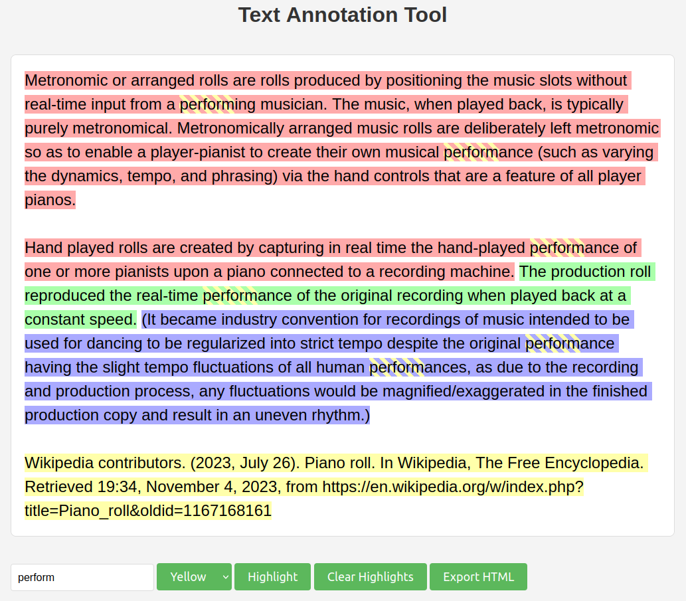

## Overview

[Demo Server](https://annotate.s-christy.com/)

<p align="center">
  
</p>

Sometimes complicated prose can be difficult to parse. I have a habit of opening
up a word processor and highlighting parts of the text in different colors to
"break it down". For instance, I might highlight supporting evidence in one
color, factual errors in another color, and things I need to look into further
in a third color.

There is a big problem with this method: if a stretch of text falls into two
groups at once, I can't highlight it *both* red and yellow in Google Docs, or
Word, or any other program I've tried.

For this reason, I made this simple little utility that indicates text that
belongs to multiple groups using a striped pattern.

## Features

- Allows the user to add a highlight quickly using the mouse
- Annotated text can be exported as HTML to paste elsewhere
- Dialog to confirm before deleting a highlight
- Comes with four default colors that can be selected with the 1-4 keys
- Buttons to automatically highlight a string or clear all highlights
- No dependencies except Python 3
- Simple but bold styling

## Usage

Simply run the `serve.sh` script in the repository root.

## Dependencies

```
python3
```

## License

This work is licensed under the GNU General Public License version 3 (GPLv3).

[](https://www.gnu.org/licenses/gpl-3.0.en.html)
